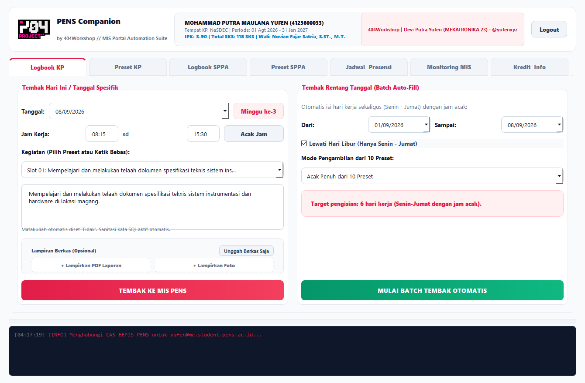
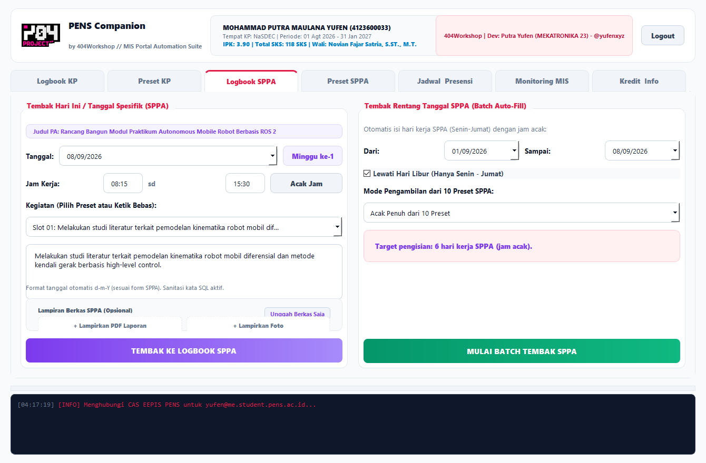
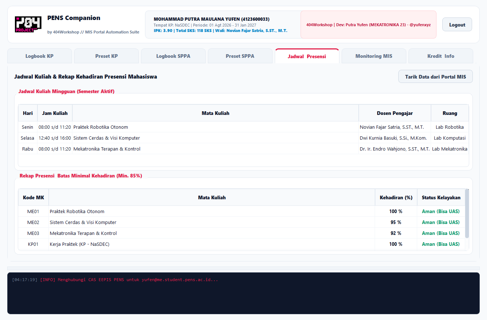
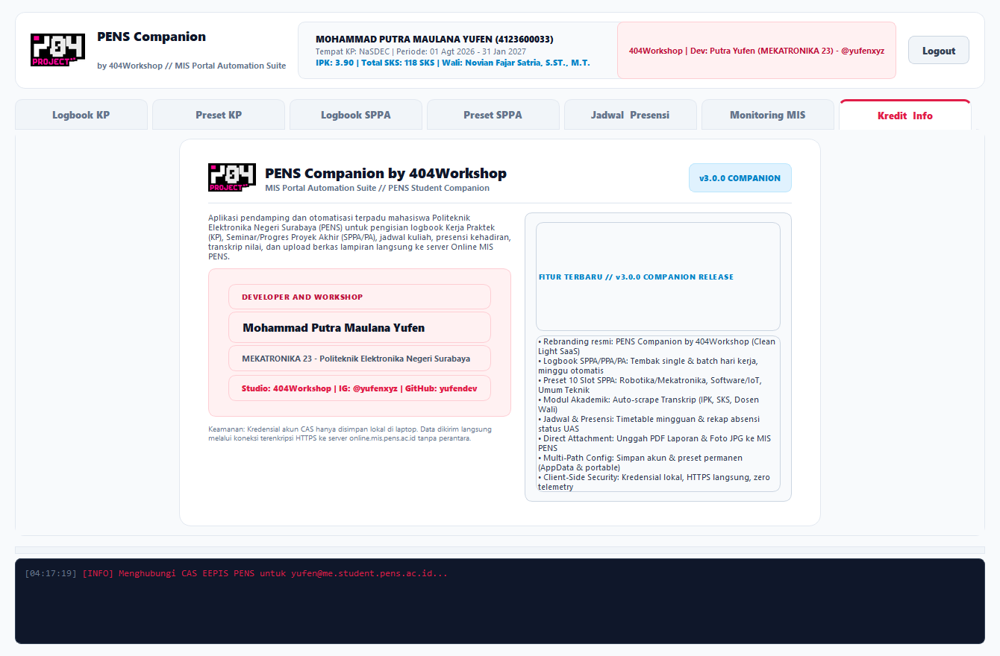

# PENS Companion by 404Workshop

[]()
[]()
[]()
[]()
[]()
[]()

Desktop automation and academic intelligence client for students of **Politeknik Elektronika Negeri Surabaya (PENS)**. Integrates daily internship (*Kerja Praktek / Magang*) logbook automation, Final Project (*SPPA / PPA / Proyek Akhir*) tracking, lecture schedules, course attendance monitoring, and direct file uploading into the official PENS Online MIS portal (`https://online.mis.pens.ac.id`).

Engineered by **Mohammad Putra Maulana Yufen** (MEKATRONIKA '23) &bull; **404Workshop** ([@yufenxyz](https://instagram.com/yufenxyz)).

---

## Screenshots & UI Preview

| Logbook KP (Internship Automation) | Logbook SPPA (Final Project Engine) |
|:---:|:---:|
|  |  |

| Academic Intelligence (Schedule & Attendance) | Credits & Companion Changelog |
|:---:|:---:|
|  |  |

---

## What's New in v3.0.0 (Companion Release)

* **Dual Logbook Engine (KP + SPPA/PA):** Full support for both Internship (*Kerja Praktek*) and Final Project (*Seminar & Progres Proyek Akhir*) logbook entry with automated week calculations and `d-m-Y` form formatting.
* **10-Slot Modular SPPA Presets:** Out-of-the-box activity templates for Robotics/Mechatronics/Embedded, Software/IoT/AI, and General Engineering.
* **Academic Intelligence Module:** Direct crawling and presentation of cumulative GPA (*IPK*), completed credits (*SKS*), Academic Advisor (*Dosen Wali*), weekly class timetable, and attendance percentage (*Presensi*) with UAS eligibility warnings.
* **Direct Attachment Uploader:** Upload PDF progress reports and JPG documentation photos directly to the MIS portal without touching a browser.
* **Multi-Path Config Persistence:** Local credentials and custom preset slots automatically synchronize across both portable directories and `%LOCALAPPDATA%`, surviving app moves and updates.
* **Pure Client-Side Security:** Zero analytics, zero background telemetry, and direct HTTPS connections to official PENS servers.

---

## Core Capabilities

### 1. Reverse-Engineered CAS Handshake
* Handles Apereo Central Authentication Service (`login.pens.ac.id`) handshakes natively.
* Extracts one-time login execution tokens (`lt`) and execution flows dynamically.
* Maintains session cookies seamlessly across multi-threaded asynchronous workers.

### 2. Automated Internship Logbook (`entry_logbook_kp1.php`)
* **Single-Day Submission:** One-click instant submission for specific or current dates.
* **Batch Auto-Fill Engine:** Fills date ranges across working days (Monday–Friday), skipping weekends automatically.
* **Realistic Time Variation:** Randomized work hours between 08:00–10:00 (start) and 14:00–16:00 (finish) to maintain natural attendance patterns.
* **WAF Sanitization:** Transparently filters out SQL keywords (`SELECT`, `INSERT`, `UPDATE`, `DELETE`) to avoid silent server-side rejections.

### 3. Final Project Logbook Engine (`entry_logbook_ta.php`)
* Handles target week calculations from project inception date.
* Automatically converts date structures to the portal's strict `d-m-Y` format.
* Dedicated 10-slot preset memory pool for thesis and capstone engineering workflows.

### 4. Academic Dashboard & Attendance Verification
* Scrapes student transcript data (`cetak_transkripSemMBKM.php`) for live IPK, total SKS, and advisor info.
* Formats full weekly class schedule with instructor names, time intervals, and classroom codes.
* Analyzes course attendance records (`absen.php`):
  * **>= 85%:** Safe (Eligible for Final Exam / UAS)
  * **75% - 84%:** Warning threshold
  * **< 75%:** Critical attendance deficit

### 5. In-App File Uploading
* Direct multi-part form dispatch for PDF documents (`kirimfile1` / `fileupload`) and photo documentation (`kirimfile2` / `fileupload2`).
* Supports uploading to both Internship (`mEntry_Logbook_KP1.php`) and Final Project (`mEntry_Logbook_TA.php`) storage endpoints.

---

## Technical Architecture

```
PENS-Companion/
├── pens_logbook_app.py     # Main application codebase (PyQt5 GUI, Core Engine & Workers)
├── config_logbook.json     # Local fallback persistent user configurations and preset slots
├── app_icon.ico            # Multi-resolution application icon
├── logo_header.png         # 404Workshop brand assets (Dashboard)
├── logo_login.png          # 404Workshop brand assets (Login View)
└── dist/
    └── 404NotFound_Entry_Logbook.exe  # Standalone frozen binary
```

* **GUI Stack:** PyQt5 with Clean Light SaaS design tokens and neon brand accents.
* **Networking:** `requests.Session` with persistent connection pooling and strict TLS verification.
* **Concurrency:** Asynchronous `QThread` architecture isolating UI rendering from network latency.
* **Target Environment:** Windows 10/11 x64, Linux (WSL/Native).

---

## Getting Started

### Running from Source

```bash
# Clone the repository
git clone https://github.com/yufendev/404NotFound-Entry-Logbook.git
cd 404NotFound-Entry-Logbook

# Install dependencies
pip install -r requirements.txt

# Launch application
python pens_logbook_app.py
```

### Building Standalone Windows Executable

```bash
pyinstaller --noconfirm --onedir --windowed \
  --add-data "logo_header.png;." \
  --add-data "logo_login.png;." \
  --icon "app_icon.ico" \
  pens_logbook_app.py
```

---

## Credits & Workshop

* **Lead Architect:** Mohammad Putra Maulana Yufen
* **Program / Department:** D4 Teknik Mekatronika '23 &bull; Politeknik Elektronika Negeri Surabaya
* **Studio:** **404Workshop** ([NotFound Workshop](https://github.com/yufendev))
* **Socials:** Instagram [@yufenxyz](https://instagram.com/yufenxyz) &bull; GitHub [@yufendev](https://github.com/yufendev)

---

## License & Privacy Notice

Distributed under the MIT License. K-Line / MIS automation utilities within this repository interact strictly between the client machine and official institutional endpoints. No user credentials, session identifiers, or academic records are collected, logged, or transmitted to any third-party infrastructure.
